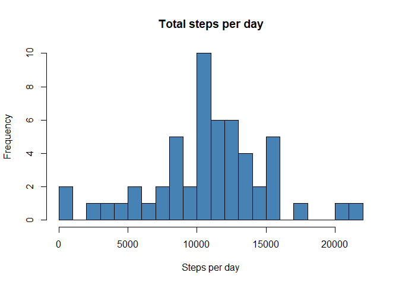
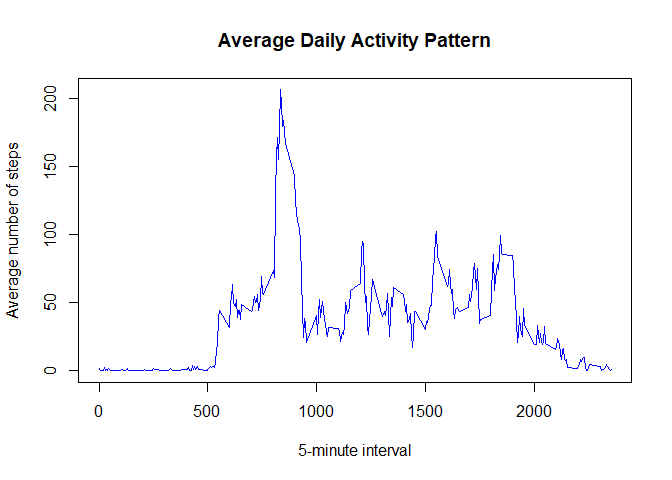
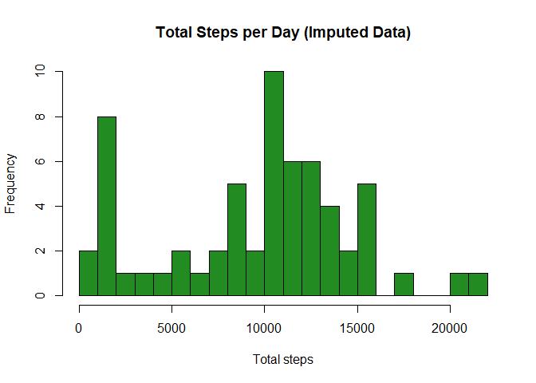
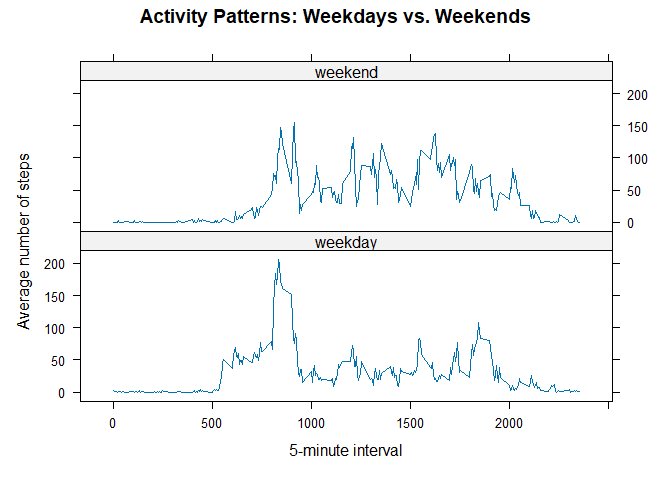

#### Configurations to ensure the consistency of the results:


``` r
options(scipen = 999)
Sys.setlocale("LC_TIME", "C")
```

```
## [1] "C"
```

## Loading and preprocessing the data


``` r
myData <- read.csv("activity.csv")

head(myData)
```

```
##   steps       date interval
## 1    NA 2012-10-01        0
## 2    NA 2012-10-01        5
## 3    NA 2012-10-01       10
## 4    NA 2012-10-01       15
## 5    NA 2012-10-01       20
## 6    NA 2012-10-01       25
```

``` r
str(myData)
```

```
## 'data.frame':	17568 obs. of  3 variables:
##  $ steps   : int  NA NA NA NA NA NA NA NA NA NA ...
##  $ date    : chr  "2012-10-01" "2012-10-01" "2012-10-01" "2012-10-01" ...
##  $ interval: int  0 5 10 15 20 25 30 35 40 45 ...
```


Since the date column is in "chr" format, it has to be converted to "Date" format:


``` r
myData$date <- as.Date(myData$date)

str(myData)
```

```
## 'data.frame':	17568 obs. of  3 variables:
##  $ steps   : int  NA NA NA NA NA NA NA NA NA NA ...
##  $ date    : Date, format: "2012-10-01" "2012-10-01" ...
##  $ interval: int  0 5 10 15 20 25 30 35 40 45 ...
```


## What is mean total number of steps taken per day?


``` r
totalStepsPerDay <- aggregate(
  steps ~ date, 
  data = myData, 
  FUN = sum, 
  na.rm = TRUE
)

head(totalStepsPerDay)
```

```
##         date steps
## 1 2012-10-02   126
## 2 2012-10-03 11352
## 3 2012-10-04 12116
## 4 2012-10-05 13294
## 5 2012-10-06 15420
## 6 2012-10-07 11015
```

``` r
hist(
  totalStepsPerDay$steps, 
  main = "Total steps per day", 
  xlab = "Steps per day", 
  col = "steelblue", 
  breaks = 20
)
```

<!-- -->

``` r
meanSteps <- mean(totalStepsPerDay$steps)
medianSteps <- median(totalStepsPerDay$steps)

cat(
  "Mean steps per day:", 
  meanSteps, 
  "\n"
) 
```

```
## Mean steps per day: 10766.19
```

``` r
cat(
  "Median steps per day:", 
  medianSteps, 
  "\n"
)
```

```
## Median steps per day: 10765
```

The **mean** total number of steps per day is 10766.19 and the **median** is 10765.

## What is the average daily activity pattern?


``` r
averageStepsPerInterval <- aggregate(
  steps ~ interval, 
  data = myData, 
  FUN = mean,
  na.rm = TRUE
) 

head(averageStepsPerInterval)
```

```
##   interval     steps
## 1        0 1.7169811
## 2        5 0.3396226
## 3       10 0.1320755
## 4       15 0.1509434
## 5       20 0.0754717
## 6       25 2.0943396
```

``` r
plot(averageStepsPerInterval$interval,
     averageStepsPerInterval$steps, 
     type = "l", 
     col = "blue", 
     xlab = "5-minute interval", 
     ylab = "Average number of steps", 
     main = "Average Daily Activity Pattern"
)
```

<!-- -->

``` r
maxInterval <-
  averageStepsPerInterval[which.max(averageStepsPerInterval$steps), ]

cat(
  "Interval with the maximum average number of steps:",
  maxInterval$interval,
  "\n"
)
```

```
## Interval with the maximum average number of steps: 835
```

``` r
cat(
  "Maximum average number of steps in that interval:",
  round(maxInterval$steps, 2),
  "\n"
)
```

```
## Maximum average number of steps in that interval: 206.17
```

The **interval with the maximum average number of steps** is 835, associated with a **value** of 206.17 steps.


## Imputing missing values


``` r
totalMissing <- sum(is.na(myData$steps))

cat("Total number of missing values in 'steps':", totalMissing, "\n")
```

```
## Total number of missing values in 'steps': 2304
```

``` r
myDataImputed <- myData

myDataImputed$index <- 1:nrow(myDataImputed)
```

The **median value for each interval** was chosen to be used to replace the NA values:


``` r
medianStepsPerInterval <- aggregate(
  steps ~ interval, 
  data = myData, 
  FUN = median, 
  na.rm = TRUE
)

myDataImputed <- merge(
  myDataImputed, 
  medianStepsPerInterval, 
  by = "interval", 
  suffixes = c(
    "", 
    ".median"
  )
)

myDataImputed$steps[is.na(myDataImputed$steps)] <- 
  myDataImputed$steps.median[is.na(myDataImputed$steps)]

myDataImputed$steps.median <- NULL

myDataImputed <- myDataImputed[order(myDataImputed$index), ]

myDataImputed$index <- NULL

rownames(myDataImputed) <- NULL

head(myDataImputed)
```

```
##   interval steps       date
## 1        0     0 2012-10-01
## 2        5     0 2012-10-01
## 3       10     0 2012-10-01
## 4       15     0 2012-10-01
## 5       20     0 2012-10-01
## 6       25     0 2012-10-01
```

``` r
totalStepsPerDayImputed <- aggregate(
  steps ~ date, 
  data = myDataImputed, 
  FUN = sum
)

hist(
  totalStepsPerDayImputed$steps, 
  main = "Total Steps per Day (Imputed Data)", 
  xlab = "Total steps", 
  col = "forestgreen", 
  breaks = 20
)
```

<!-- -->

``` r
meanImputed <- mean(totalStepsPerDayImputed$steps)
medianImputed <- median(totalStepsPerDayImputed$steps)

cat("Mean total steps per day (after imputation):", round(meanImputed, 2), "\n") 
```

```
## Mean total steps per day (after imputation): 9503.87
```

``` r
cat("Median total steps per day (after imputation):", round(medianImputed, 2), "\n")
```

```
## Median total steps per day (after imputation): 10395
```

After the imputation, the **mean** total number of steps per day is 9503.87 and the **median** is 10395.

- The **mean has decreased**, as many missing values (NA), previously excluded from calculations, were replaced with zeros.

- The **median has also decreased**, reflecting the impact of adding zeros, which shifted the distribution of values downward.

## Are there differences in activity patterns between weekdays and weekends?


``` r
myDataImputed$dayType <- ifelse(weekdays(myDataImputed$date) %in% c("Saturday", "Sunday"), "weekend", "weekday")

myDataImputed$dayType <- factor(
  myDataImputed$dayType, 
  levels = c(
    "weekday", 
    "weekend"
  )
)

averageStepsByDayType <- aggregate(
  steps ~ interval + dayType, 
  data = myDataImputed,                                    
  FUN = mean
)

library(lattice)

xyplot(
  steps ~ interval | dayType, 
  data = averageStepsByDayType,
  type = "l",
  layout = c(1, 2), 
  xlab = "5-minute interval",
  ylab = "Average number of steps",
  main = "Activity Patterns: Weekdays vs. Weekends"
)
```

<!-- -->

Examining both graphs, we can observe that during weekends, within the 10:00 to 18:00 hours interval, there is a higher number of steps being taken.

